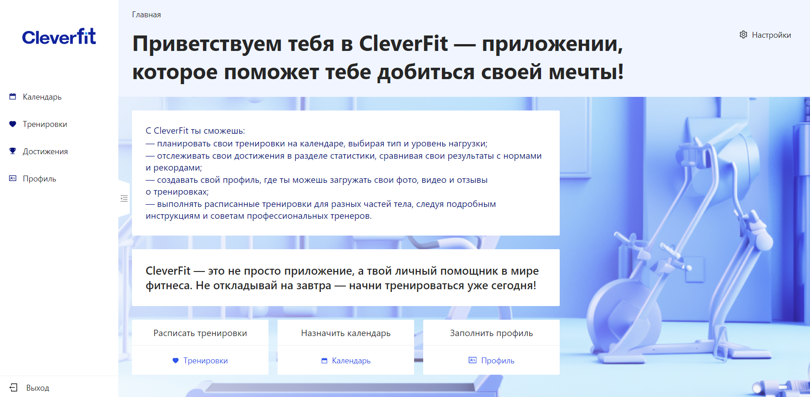
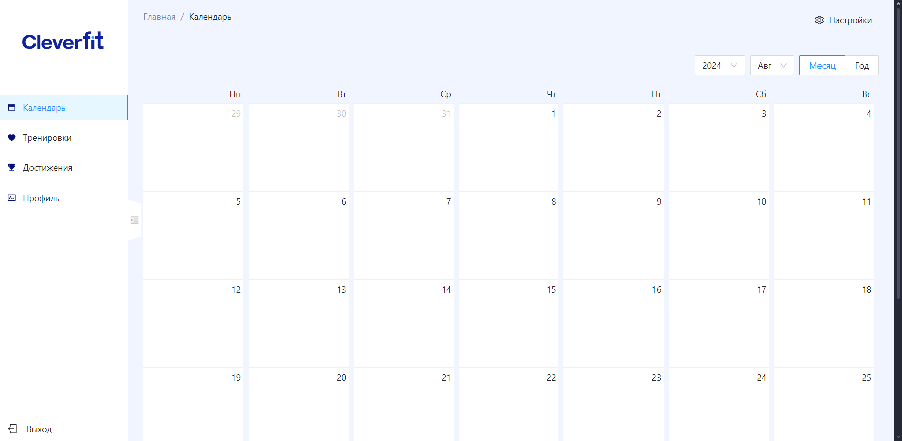
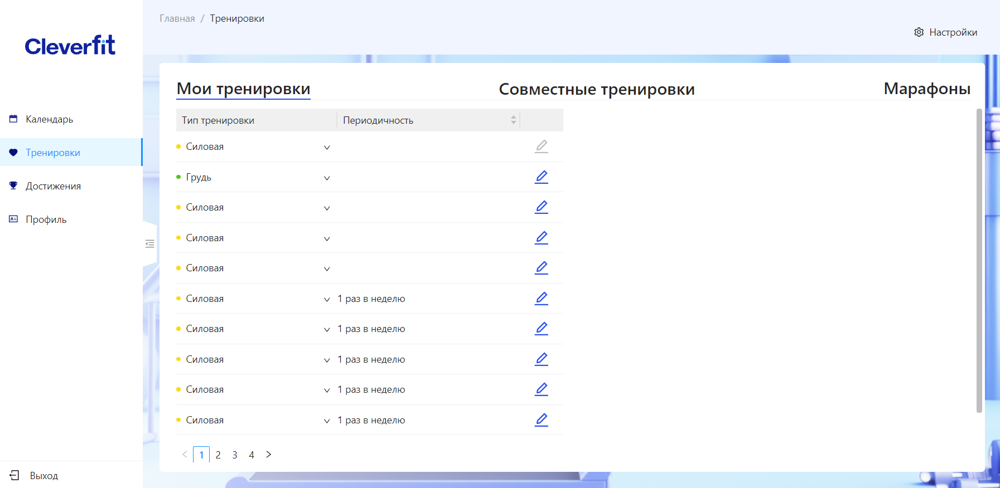
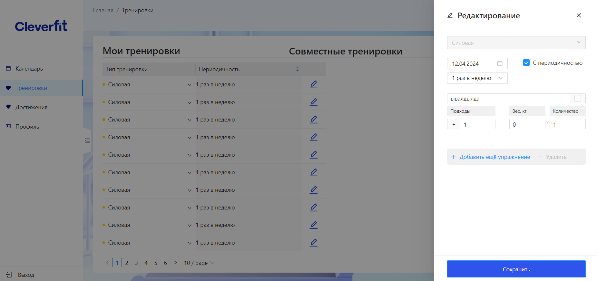
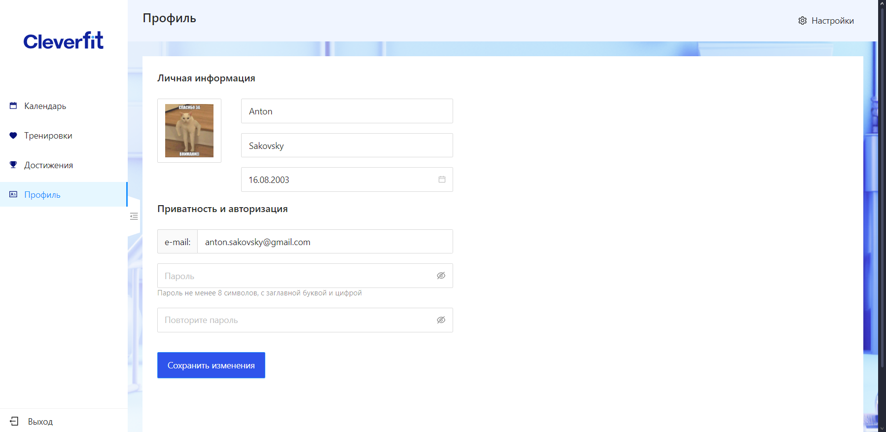
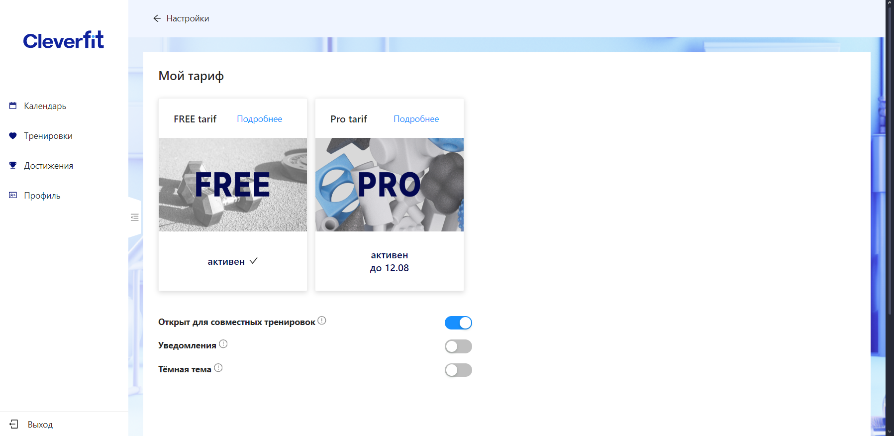
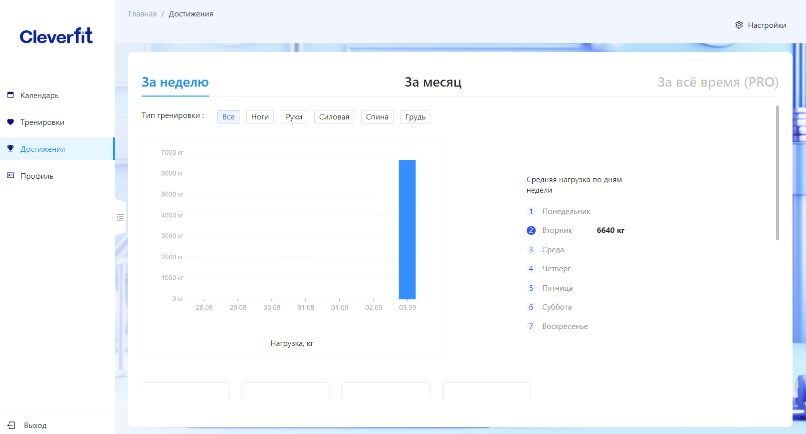
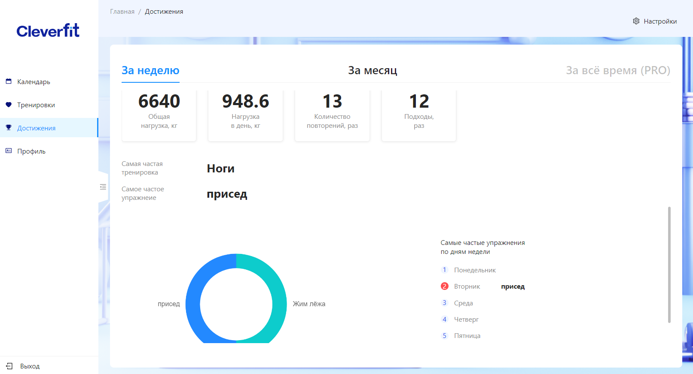
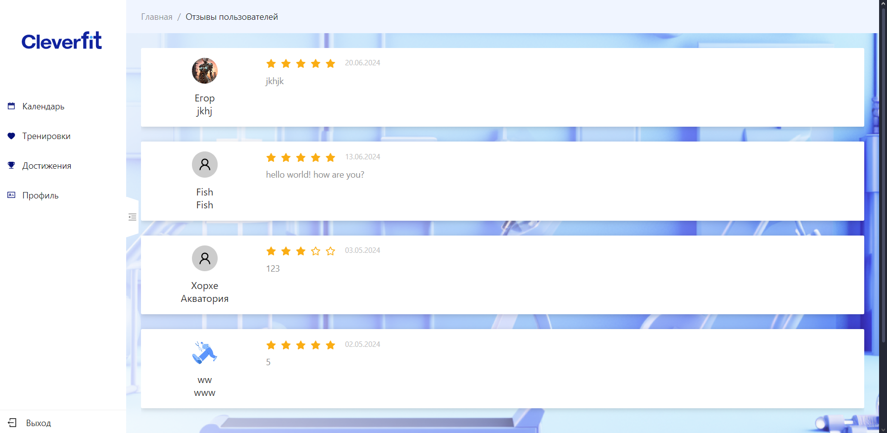
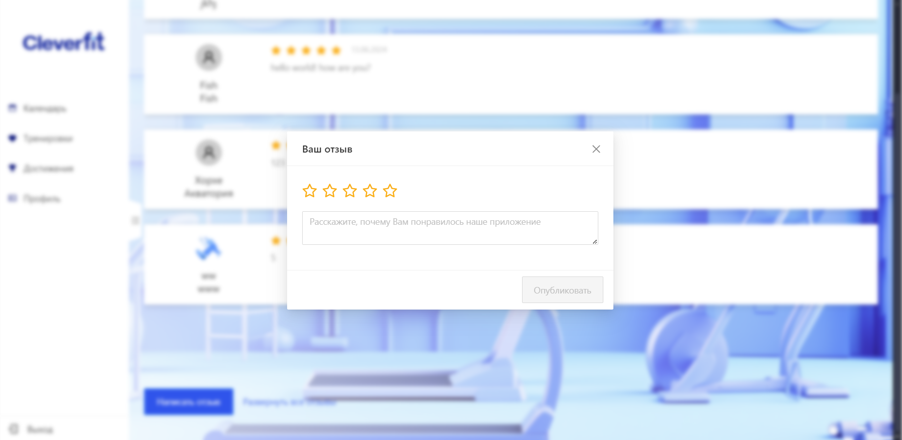

# Workout planner CleverFit

## Description

The best workout planner to help you get into the shape of your dreams..

## Screenshots

<h3 style='margin: 5px 0px' >Login form</h3>

<h3 style='margin: 5px 0px' >Main page</h3>

<h3 style='margin: 5px 0px' >Calendar page</h3>

<h3 style='margin: 5px 0px' >Training page</h3>

<h3 style='margin: 5px 0px' >Edit training</h3>

<h3 style='margin: 5px 0px' >Profile page</h3>

<h3 style='margin: 5px 0px' >Settings page</h3>

<h3 style='margin: 5px 0px' >Achievements page</h3>

<h3 style='margin: 5px 0px' >Feedback page</h3>

<h3 style='margin: 5px 0px' >Add feedback form</h3>

## Built With

## Contacts

